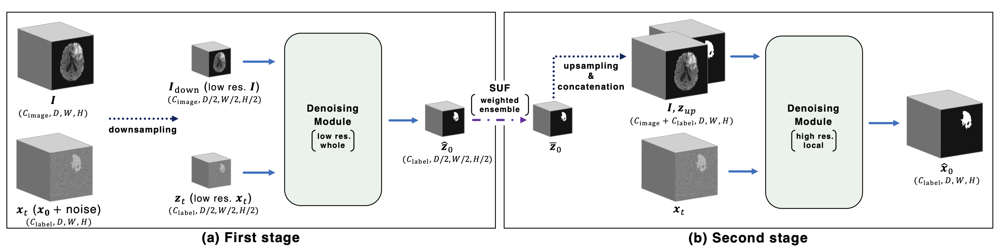

# Two-Stage Diffusion Model for 3D Medical Image Segmentation

This model is a novel two-stage diffusion-based segmentation model that retains its original structure with reduced computational costs. And, The paper of this has been officially accepted by IJCNN 2024.

## Model overview


## Requirement
Python >= 3.8.16
```bash
pip install -r requirement.txt
```

## How to use
1. Go to [BraTS official cite](https://www.synapse.org/#!Synapse:syn51156910/wiki/622351) and download the brain MRI data.
2. Rewrite args.py as needed for information such as data storage location.
3. Run the following:
```bash
  python two_stage_train1st.py
  python two_stage_createData1st.py
  python two_stage_train2nd.py
  python two_stage_createData2nd.py
```

## Evaluation
Evaluate according to [this repository](https://github.com/rachitsaluja/BraTS-2023-Metrics), which is the official performance metrics program.
